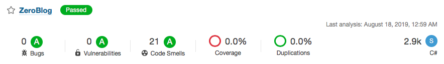

# ZeroBlog

## Tasarım Desenleri

-  **Domain Driven Design:** Hızlı değişen gereksinimlere hızlı adaptasyon sağlayan, kolay ölçeklenebilir, esnek ve yüksek erişilebilir bir yaklaşımı olduğu için tercih edilmiştir.
-  **Repository Pattern  :** Veriye erişimin ve yönetimin tek noktaya indirilmesini sağlamak amacıyla kullanılmıştır.
-  **Unit Of Work Pattern:** İş katmanında yapılan her değişikliğin anlık olarak database e yansıması yerine, işlemlerin toplu halde tek bir kanaldan gerçekleşmesi sağlanmıştır.
-  **Abstract Factory Pattern:** İlişkisel olan birden fazla nesnenin oluşturulmasında tek bir arayüz tarafından değil her ürün ailesi için farklı bir arayüz tanımlayarak sağlanmaktadır.

- **SOLID** prensiplerine uygun olarak geliştirme yapılmıştır.
- **TDD** uygulanmıştır.

## Kütüphaneler

- **Automapper**
- **Dapper**
- **FluentValidation**
- **Castle Windsor :** Uygulama içerisinde kullanılan objelerin instance' larının yönetimi ve uygulama boyunca yaşam döngüsünün kontrolü içn kullanılmıştır. (Autofac'te kullanılabilirdi.)
- **Jwt :** Authentication

# Kurulum

Veritabanı MySQL dir. Veritabanı script'i data klasörünün altındadır. Default kullanıcı girişi aşağıdaki gibir. Aşağıdaki yöntemler ile çalıştırabilirsiniz.

*Email:* admin@admin.com

*Password:* 123456

## Dockerize
> Çalıştırmak için

```bash
docker-compose up
```
*http://localhost:8080/swagger/index.html*

> Sonlandırmak için 
```bash
docker-compose down -v
```

## Script Kullanarak Çalıştırma

**data** klasörünün altındaki **init.sql** scripti yüklenmelidir.

**appsettings.json** dosyasından aşağıdaki connection'ları *localhost* olarak değiştirerek çalıştırabilirsiniz.

```javascript
  "ConnectionString": {
    "Default": "server=localhost;port=3306;database=blog;userid=root;pwd=dbuserpassword;"
  },
  "Cache": {
    "RedisConnection": "localhost:6379"
  }
```
## Analiz


*İletişim:* ercanatbas@hotmail.com
